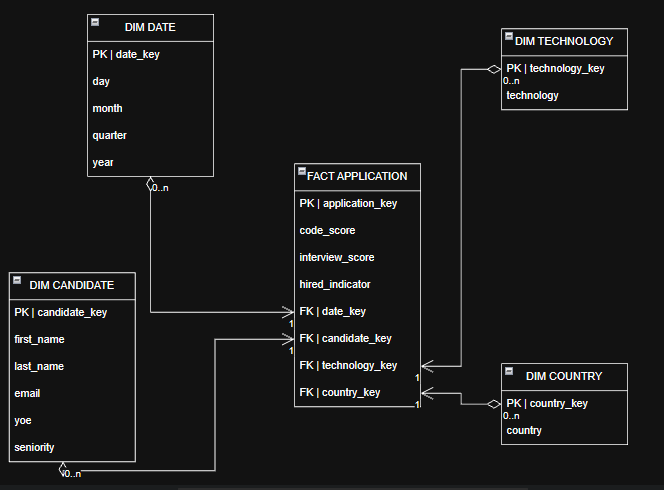

# WORKSHOP1

# BUSINESS CONTEXT

Consider a company dedicated to recruiting talent in the technology sector. As part of its selection processes, it receives candidates with different professional profiles and characteristics related to their experience and knowledge in technology. For each candidate, the company has information such as their country of origin, level of seniority, years of professional experience, and the technology areas in which they specialize.
In addition to the relevant information for each candidate, the company conducts a technical evaluation during the selection process. This evaluation consists of two main results: The Code Challenge Score, which reflects the candidate’s performance on a coding test, and the Technical Interview Score, which corresponds to the result obtained in the technical interview. 
Currently, this information is available as operational data from candidate applications. However, relying solely on this data does not provide a direct analytical view of the recruitment process. The company needs to transform this information into a system that allows it to analyze application results from different perspectives and identify patterns related to hiring.
The business process to be analyzed involves the evaluation and outcomes of candidate applications within the technology recruitment process. Each record represents an application submitted by a candidate and contains information about the candidate’s profile, professional qualifications, and performance on technical assessments. Based on these records, the goal is to analyze the results of the selection and hiring process to generate useful insights for recruitment management.


# Objetivo del proyecto

To build an analytical system that transforms operational data from candidate applications into structured, useful information for analyzing the technology recruitment process.
The system will enable the analysis of hiring outcomes from various perspectives, such as trends over time, the technologies associated with candidates, their seniority levels and years of experience, their countries of origin, and their performance on technical assessments. In this way, the information can be used to identify patterns in the selection processes, compare results across different profiles, and provide insights to support decision-making related to recruitment management.
To achieve this objective, application data will be organized and transformed into an analytical structure that enables queries, generates metrics, and subsequently produces visualizations designed to address the company’s specific needs. The ultimate goal is not merely to store data, but to convert it into insights that provide a better understanding of the selection process’s outcomes and support evidence-based management decisions.


# Business Requirements

The requirements for the analysis were as follows:

| ID     | Requirement                                                                                                                |
| ------ | -------------------------------------------------------------------------------------------------------------------------- |
| **R1** | How has the number of hires changed over time?                                                                             |
| **R2** | Which technologies are in highest demand and yield the best hiring results?                                                |
| **R3** | Which candidate profiles yield the best hiring results based on their seniority and experience?                            |
| **R4** | Which countries represent the most attractive recruitment markets in terms of the number of candidates and their hiring rate? |
| **R5** | Which technologies pose challenges when it comes to converting leads into contracts?                                       |


# Descripción del dataset

El proyecto utiliza como fuente principal el archivo:

```text
data/raw/candidates.csv
```

The dataset contains information related to applications submitted by candidates, including personal information, location, experience, technology, dates, and assessment results.

Key attributes include:

| Column                    | Description                      |
| ------------------------- | -------------------------------- |
| First Name                | Candidate's Name                 |
| Last Name                 | Candidate's Last Name            |
| Email                     | Email                            |
| Country                   | Candidate's country              |
| Application Date          | Effective Date                   |
| YOE                       | Years of experience              |
| Seniority                 | Seniority Level                  |
| Technology                | Related Technology               |
| Code Challenge Score      | Technical Test Score             |
| Technical Interview Score | Technical Interview Score         |

---

# Project Structure

The main organizational structure of the project is as follows:

```text
workshop-1/
│
├── data/
│   └── raw/
│       └── candidates.csv
│
├── notebooks/
│   └── data_profiling.py
|
├── powerbi/
│   └── workshop dashboard.pbix
│
|── results/
│   ├── result1.csv
│   ├── result2.csv
│   ├── result3.csv
│   ├── result4.csv
│   └── result5.csv
|
├── src/
│   ├── extract.py
│   ├── transform.py
│   ├── dimensional_model.py
│   ├── validation.py
│   ├── load.py
│   └── main.py
│
├── sql/
│   ├── create_tables.sql
│   └── analytical_queries.sql
│
├── diagrams/
│   └── star_schema.png
│
├── requirements.txt
├── .gitignore
└── README.md
```


# Initial Data Profiling

Initial profiling was implemented in:

```text
notebooks/data_profiling.py
```

This process analyzes the original dataset without modifying it. To maintain a single source of data extraction, the script reuses the `extract_data()` function defined in `src/extract.py`.

## Analyses Conducted

Data profiling includes:

1. Number of rows and columns.
2. Column names and original data types.
3. Identification of missing values.
4. Identification of duplicate records.
5. Review of unique values in categorical variables.
6. Analysis of the date range.
7. Descriptive statistics for numerical variables.
8. Validation of score ranges.
9. Summary of findings.

## Key Findings

| Appearance                     | Discovery                                                                                                    |
| ------------------------------ | ------------------------------------------------------------------------------------------------------------ |
| Dataset size                   | 50,000 rows and 10 columns                                                                                   |
| Null values                    | No null values found                                                                                         |
| Completely duplicate rows      | None found                                                                                                   |
| Duplicate emails               | There are records that may share the same email address, but they represent different applications and are not automatically deleted |
| Application Date               | Was found as text and was later converted to a date type                                                     |
| Seniority                      | 7 seniority levels                                                                                       |
| Technology                     | 24 different technologies                                                                                    |
| Country                        | 244 different countries                                                                                        |
| Code Challenge Score           | Values in the range of 0 to 10                                                                           |
| Technical Interview Score      | Values ranging from 0 to 10                                                                           |

### Decision on Duplicate Records

Duplicate values in the `Email` column were not automatically deleted. The granularity defined for the project corresponds to **an application**, so two records with the same email address may represent different applications.

For this reason, deleting records solely because they share the same email address could result in a loss of information.


# Extraction Process

The extraction was implemented in:

```text
src/extract.py
```

The main function is:

```python
extract_data()
```

Its sole responsibility is to read the original file:

```text
data/raw/candidates.csv
```

The file is loaded using:

```python
pd.read_csv(source_path, sep=";")
```

## Implementation Decisions

During the extraction stage:

* The original source file is used.
* The original file is not modified.
* No business transformations are applied.
* No records are deleted.
* The file is checked for existence before attempting to read it.
* A DataFrame is returned with the data exactly as it comes from the source.

This allows for a clear separation of the extraction stage from the subsequent preparation and transformation stages.

---

# Data Preparation and Transformation

The transformations were implemented in:

```text
src/transform.py
```

The process is divided into two main stages.

## Data Preparation

The function:

```python
prepare_data(df)
```

performs the following actions:

### Date Conversion

The column:

```text
Application Date
```

is converted to a date type:

```python
pd.to_datetime(
    df[“Application Date”],
    format="%Y-%m-%d"
)
```

### Removing Spaces

Extra spaces at the beginning and end of the text columns are removed:

* First Name
* Last Name
* Email
* Country
* Seniority
* Technology

### Seniority Order

A logical order is established for seniority levels:

```text
Intern
→ Trainee
→ Junior
→ Mid-Level
→ Senior
→ Lead
→ Architect
```

This facilitates the subsequent organized analysis of candidate profiles.

### Conversion of Categorical Variables

The columns:

```text
Technology
Country
```

are converted to categorical variables.

### Checking for Missing Values

After data preparation, an additional check is performed to identify any missing values.


## Hiring Business Rule

The function:

```python
apply_business_rules(df)
```

implements the following rule:

```text
HIRED =
(Code Challenge Score >= 7)
AND
(Technical Interview Score >= 7)
```

In other words, a candidate is considered hired only when they score 7 or higher on both assessments.

The result is stored in a new column:

```text
Hired
```

with Boolean values.

### Important Decision

The transformation **does not remove unhired applications**.

This is necessary because the model’s granularity is an application, and the requirements need to analyze both the total number of applications and the number of hires.

Removing the `NOT HIRED` records would prevent the correct calculation of metrics such as:

```text
Hiring Rate =
Total Hired / Total Applications
```


# Dimensional Model

A dimensional model of the following type was implemented:

# Star Schema

The model consists of:

* 4 dimensions.
* 1 fact table.

The dimensional transformation is located in:

```text
src/dimensional_model.py
```


## Granularity of the Fact Table

The defined granularity is:

> **A row in `fact_application` represents a candidate’s application for a specific technology on a specific date and in a specific country.**

This definition allows each application to be treated as an individual observation and subsequently analyzed from different dimensions.


## Dimensions

### `dim_date`

| Field      | Description                 |
| ---------- | --------------------------- |
| `date_key` | Date surrogate key         |
| `day`      | Day                         |
| `month`    | Month                         |
| `quarter`  | Quarter                   |
| `year`     | Year                         |

During the transformation, `full_date` is temporarily used to link each application to its `date_key`.

However, `full_date` is removed before the final dimensional schema is returned.


### `dim_candidate`

| Field           | Description                   |
| --------------- | ----------------------------- |
| `candidate_key` | Candidate surrogate key |
| `first_name`    | First Name                        |
| `last_name`     | Last Name                      |
| `email`         | Email                        |
| `yoe`           | Years of Experience           |
| `seniority`     | Seniority Level            |


### `dim_technology`

| Field            | Description     |
| ---------------- | --------------- |
| `technology_key` | Surrogate key |
| `technology`     | Technology      |


### `dim_country`

| Field         | Description     |
| ------------- | --------------- |
| `country_key` | Surrogate key |
| `country`     | Country            |


##  Fact Table

### `fact_application`

| Field             | Data Type | Description                      |
| ----------------- | ----------- | -------------------------------- |
| `application_key` | PK          | Application surrogate key |
| `date_key`        | FK          | Foreign key to `dim_date`          |
| `candidate_key`   | FK          | Foreign key to `dim_candidate`     |
| `technology_key`  | FK          | Foreign key to `dim_technology`    |
| `country_key`     | FK          | Foreign key to `dim_country`       |
| `code_score`      | Metric      | Code Challenge score        |
| `interview_score` | Metric      | Technical Interview score   |
| `hired_indicator` | Metric      | 1 for HIRED and 0 for NOT HIRED  |


## surrogate keys

All dimensions use sequentially generated surrogate keys:

```text
1, 2, 3, ...
```

These keys are independent of the natural keys in the source.

For example, the following are not used:

```text
email
technology
country
Application Date
```

as primary keys for the dimensions.

This allows the dimensional model to be decoupled from the dataset’s natural identifiers.


## Integrity During Model Construction

To build the fact table, each application is related to the corresponding dimensions using `merge`.

Next, the system verifies that no foreign keys have been left unassigned:

```text
date_key
candidate_key
technology_key
country_key
```

If any relationship fails to find a corresponding dimension, the process generates an error and prevents the creation of an inconsistent fact table.


## Model Diagram

The implemented schema corresponds to the star schema.

> The visual diagram must be included in the repository at:
>
> ```text
> diagrams/star_schema.png
> ```


# Pre-Load Quality Validations

Before loading the data into MySQL, validations implemented in the following file are run:

```text
src/validation.py
```

The goal is to detect issues before inserting data into the data warehouse.

The main function is:

```python
run_all_validations(df_source, star_schema)
```


## Primary Key Validation

For each table, the following is verified regarding its primary key:

* It does not contain null values.
* It is unique.

The validated keys are:

| Table              | Primary Key    |
| ------------------ | ----------------- |
| `dim_date`         | `date_key`        |
| `dim_candidate`    | `candidate_key`   |
| `dim_technology`   | `technology_key`  |
| `dim_country`      | `country_key`     |
| `fact_application` | `application_key` |


##  Referential Integrity

The system verifies that each foreign key in `fact_application` exists in its corresponding dimension.

The relationships checked are:

```text
date_key
candidate_key
technology_key
country_key
```

The process cannot continue if any of the following exist:

* Null values in foreign keys.
* References to nonexistent keys.
* Orphaned values.


## Record Count

The following is compared:

```text
Number of records in the transformed dataset
```

against:

```text
Number of rows in `fact_application`
```

This verifies that during the transformation:

* No applications were lost.
* No applications were duplicated.


## Metric Validation

The following rules are validated:

| Metric            | Rule              |
| ----------------- | ------------------ |
| `code_score`      | Between 0 and 10       |
| `interview_score` | Between 0 and 10       |
| `hired_indicator` | Only values 0 or 1 |

If any critical validation fails, the following is raised:

```text
ValidationError
```

and the pipeline does not proceed to the load stage.


# Loading into the Data Warehouse

The load was implemented in:

```text
src/load.py
```

The database engine used is:

# MySQL

The database used is:

```text
recruitment_dw
```

The connection is established using:

* SQLAlchemy
* PyMySQL
* python-dotenv

## Configuring Credentials

Credentials are loaded from a file:

```text
.env
```

The variables used are:

```text
DB_HOST
DB_PORT
DB_USER
DB_PASSWORD
DB_NAME
```

The `.env` file should not be versioned in Git to avoid exposing credentials.


## Creating the Physical Schema

The script:

```text
sql/create_tables.sql
```

creates the Data Warehouse tables.

Included are:

* Primary keys.
* Foreign keys.
* Data types corresponding to the attributes.

The foreign keys in the fact table are:

```text
fk_fact_date
fk_fact_candidate
fk_fact_technology
fk_fact_country
```


## Load Order

The load is performed while respecting the dependencies between the tables:

```text
1. dim_date
2. dim_candidate
3. dim_technology
4. dim_country
5. fact_application
```

The dimensions are loaded first, followed by the fact table.

This order prevents referential integrity errors.

# Post-Load Validation

After loading the data, validations are performed directly against MySQL.

This is important because it validates not only the DataFrame in memory but also the actual result stored in the data warehouse.

Validations include:

## Primary Keys

The following are compared:

```sql
COUNT(*)
```

against:

```sql
COUNT(DISTINCT primary_key)
```

and the absence of null values is verified.


## Referential Integrity

Queries using `LEFT JOIN` between `fact_application` and each dimension are used to detect possible orphan records.

The validation checks that all keys used in the fact table have a valid dimension.


## Record Count

For each table, the following is compared:

```text
Expected records
```

against:

```text
Records actually loaded into MySQL
```

The load is considered successful when all validations pass.


# ETL Pipeline Orchestration

The entire process is coordinated from:

```text
src/main.py
```

The pipeline executes the following stages:

```text
1. EXTRACTION
2. DATA PREPARATION
3. BUSINESS TRANSFORMATION
4. DIMENSIONAL TRANSFORMATION
5. PRE-LOAD QUALITY VALIDATION
6. LOAD TO THE DATA WAREHOUSE
7. POST-LOAD VALIDATION IN MYSQL
8. END OF PROCESS
```

Additionally, the project uses the `rich` library to generate visual reports in the console during the different stages.


# Analytical Queries

The queries are located in:

```text
sql/analytical_queries.sql
```

Each business requirement has a specific query.

## R1 — Hiring Trends

Analyzes trends in:

* Total applications.
* Total hires.
* Hiring rate.

The data is grouped by:

```text
Year
Month
```

The query allows you to identify how the hiring process has evolved over time.


## R2 — Technology Analysis

Analyzes each technology using:

* Total applications.
* Total hires.
* Hiring rate.
* Average Code Challenge Score.
* Average Technical Interview Score.

This allows you to identify technologies with the highest volume of candidates and evaluate their hiring results.


## R3 — Candidate Profile Analysis

Analyzes candidates based on:

```text
Seniority
```

The calculated metrics are:

* Average years of experience.
* Total applications.
* Total hires.
* Hiring rate.
* Average Code Challenge Score.
* Average Technical Interview Score.

This allows you to compare hiring results across different professional profiles.


##  R4 — Attractive Recruitment Markets

Analyze countries using:

* Total applications.
* Total hires.
* Hiring rate.

The results are sorted primarily by hiring rate and then by number of applications.

This allows for a comparison of the different markets available for the recruitment process.


## R5 — Technologies with Hiring Challenges

Analyzes the technologies with the lowest ability to convert applications into hires.

To avoid conclusions based on small samples, the query only considers technologies with:

```text
50 or more applications
```

The following are calculated:

* Total applications.
* Total hires.
* Hiring rate.
* Average Code Challenge Score.
* Average Technical Interview Score.

The results are sorted from lowest to highest `hiring_rate`.

# Implemented KPIs

Key performance indicators were created for the dashboard to summarize the overall performance of the recruitment process.

| KPI                         | Description                                               |
| --------------------------- | --------------------------------------------------------- |
| **Total Applications**      | Total number of applications                              |
| **Total Hired**             | Total number of candidates hired                    |
| **Hiring Rate**             | Percentage of applications that resulted in a hire |
| **Average Code Score**      | Average Code Challenge score                        |
| **Average Interview Score** | Average Technical Interview score                   |

The hiring indicator is conceptually calculated as follows:

```text
Hiring Rate =
(Total Hired / Total Applications) × 100
```


# Dashboard in Power BI

A dashboard titled:

# Recruitment Analytics Dashboard

was developed. The dashboard provides visual answers to the five business requirements.

The interface includes:

* Main title.
* Top filters.
* KPI cards.
* Five analytical visualizations.
* Side navigation.
* Consistent visual design based on dark, purple, blue, green, and pink tones, depending on the purpose of each visualization.

The available filters include:

```text
Year
Month
Technology
Country
Seniority
```

These filters allow for interactive analysis of the metrics.


## Key KPIs Tracked

Overall, the dashboard shows approximately:

| Metric               | Result |
| ----------------------- | --------: |
| Total Applications      |    50,000 |
| Total Hired             |     7,000 |
| Hiring Rate             |   13.40% |
| Average Code Score      |      5.00 |
| Average Interview Score |      5.00 |

These values provide an overview of the process before applying specific filters.


## Visualization R1 — Trends in Applications and Hires

**Chart type:** line chart.

**X-axis:** time, using the available attributes from `dim_date`, primarily year and month.

**Y-axis:** number of applications and number of hires.

**Metrics used:**

* Total Applications.
* Total Hired.

This chart allows you to compare how the volume of applications compares to the number of hires over time.


## Visualization R2 — Technology Analysis

**Chart type:** horizontal bars.

The chart allows you to identify the technologies with the highest number of applications and compare their demand within the recruitment process.

The information is supplemented by indicators and analytical queries to also evaluate hiring results.


## Visualization R3 — Results by Seniority

**Chart type:** bar chart.

This visualization compares different seniority levels based on hiring performance for each profile.

This allows you to identify which profiles yield the best results in the process.


## Visualization R4 — Top Countries

**Chart type:** horizontal bar chart.

The chart shows the countries with the best hiring results, based on an analysis of application volume and the hiring rate.


## Visualization R5 — Technologies with the Highest Hiring Difficulty

**Chart type:** horizontal bars.

This visualization highlights the technologies with the lowest hiring rates, considering only those with a minimum of 50 applications.

This prevents a technology with very few entries from leading to an unrepresentative conclusion.


# Requirement Traceability

The following table shows how each requirement was linked to the dimensional model, queries, and visualizations.

| Requirement | Dimensions Used | Key Measures                          | SQL Query               | Visualization        |
| ------------- | ---------------------- | ------------------------------------------- - | -------------------------- | -------------------- |
| **R1**        | `dim_date`             | Total Applications, Total Hired, Hiring Rate | Hiring Trends              | Timeline       |
| **R2**        | `dim_technology`       | Applications, Hired, Hiring Rate, Scores     | Technology Analysis        | Horizontal bars  |
| **R3**        | `dim_candidate`        | Experience, Hired, Hiring Rate, Scores       | Candidate Profile Analysis | Bars by seniority |
| **R4**        | `dim_country`          | Applications, Hired, Hiring Rate             | Recruitment Markets        | Horizontal bars  |
| **R5**        | `dim_technology`       | Applications, Hired, Hiring Rate, Scores     | Hiring Difficulties        | Horizontal bars  |


# Final Validation of Requirements

| Requirement | Implemented? | DW Tables Used                       | Query / KPI                                          | Main Finding                                                                                                                                     |
| ----------- | ------------ | ------------------------------------ | ---------------------------------------------------- | ------------------------------------------------------------------------------------------------------------------------------------------------ |
| **R1**      | Yes          | `fact_application`, `dim_date`       | Total Applications, Total Hired and Trends Over Time | Allows you to analyze trends in applications and hires over time.                                                          |
| **R2**      | Yes          | `fact_application`, `dim_technology` | Technology Analysis                                  |  It allows you to identify the technologies with the highest volume of applications and analyze their hiring results.                                 |
| **R3**      | Yes          | `fact_application`, `dim_candidate`  | Hiring Rate por Seniority                            | It allows you to compare hiring results across different levels of seniority and experience.                                        |
| **R4**      | Yes          | `fact_application`, `dim_country`    | Hiring Rate por Country                              | It allows you to identify the countries with the best results and highest volume in the recruitment process.                                             |
| **R5**      | Yes          | `fact_application`, `dim_technology` | Hiring Rate por Technology                           | It allows you to identify technologies that are less effective at converting applications into contracts, based on a sample size of at least 50 applications. |


# Technologies Used

The project was developed using the following tools:

| Technology      | Use                                                |
| --------------- | -------------------------------------------------- |
| Python          | ETL process development                         |
| Pandas          | Data manipulation and transformation             |
| MySQL           | Data warehouse storage                  |
| MySQL Workbench | Database administration and querying      |
| SQLAlchemy      | Connection between Python and MySQL                      |
| PyMySQL         | MySQL connection driver                         |
| python-dotenv   | Environment variable management                    |
| Rich            | Visual reports in the console                       |
| Power BI        | Data visualization and analysis                  |
| Git/GitHub      | Version control and project storage           |


# Installation and Execution

## 1. Clone the repository

```bash
git clone <REPOSITORY_URL>
```

## 2. Navigate to the project

```bash
cd workshop-1
```

## 3. Create a virtual environment

```bash
python -m venv venv
```

## 4. Activate the virtual environment

On Windows:

```bash
venv\Scripts\activate
```

## 5. Install dependencies

```bash
pip install -r requirements.txt
```

## 6. Set environment variables

Create a `.env` file with the following structure:

```env
DB_HOST=localhost
DB_PORT=3306
DB_USER=your_username
DB_PASSWORD=your_password
DB_NAME=recruitment_dw
```

> The `.env` file should not be committed to the repository.

## 7. Create the database

The database must exist before running the pipeline:

```sql
CREATE DATABASE recruitment_dw;
```

## 8. Run the ETL pipeline

From the `src` folder:

```bash
python main.py
```

The process will run:

```text
Extraction
→ Preparation
→ Business transformation
→ Dimensional transformation
→ Pre-load validations
→ Table creation
→ Load into MySQL
→ Post-load validations
```


# Dependencies

The `requirements.txt` file includes:

```text
sqlalchemy
pymysql
python-dotenv
```

Additionally, the project uses:

```text
pandas
rich
sqlalchemy
pymysql
python-dotenv
```

# Conclusions

The project made it possible to build a complete process, from transactional data stored in a CSV file to an analytical environment consisting of a data warehouse and an interactive dashboard.

Among the project’s main results are:

* **50,000 applications** were processed.
* All applications were retained throughout the process, including both accepted and rejected ones.
* A business rule was implemented to automatically identify accepted applications.
* A dimensional model was built with **4 dimensions and 1 fact table**.
* Surrogate keys were used to decouple the dimensional model from the source’s natural keys.
* Quality validations were implemented prior to loading.
* Validations were performed directly in MySQL after the load.
* Analytical queries were developed to address the five business requirements.
* A dashboard was built in Power BI with filters, KPIs, and interactive visualizations.
* The overall result shows approximately **7,000 hires out of 50,000 applications**, equivalent to a **hiring rate of 13.40%**.

In conclusion, the project demonstrates a complete data engineering workflow, from extraction and transformation to the construction of a dimensional model, storage in a data warehouse, and analytical exploitation using business intelligence tools.


Por ejemplo, debajo de la sección **Dashboard en Power BI** puedes insertar:

```md
## Vista del Dashboard


```

Y también convendría insertar la imagen del esquema estrella:

```md
## Modelo Star Schema


```
